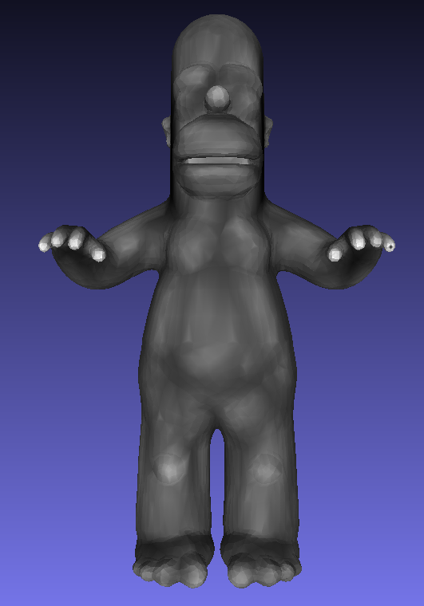
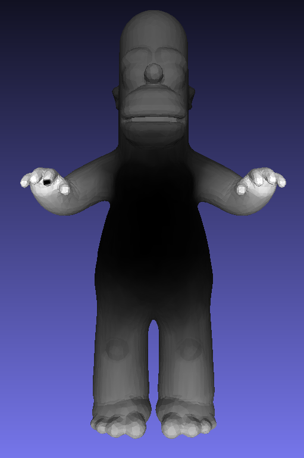
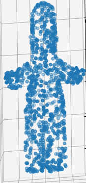

# pyhks

This is a simple dependency free Python library for the Heat Kernel Signature on triangle meshes.  The only dependencies are the numpy/scipy stack.  If you want to view the results of the computation, you should also download [meshlab].

## Running HKS
To see all options, run the script as follows
~~~~~ bash
python hks.py --help
~~~~~

As an example, let's examine the HKS on the "homer" mesh in this repository, at different scales.  In each example, we output to a file which can be opened in [meshlab], which is the homer mesh colored in grayscale with the values of the HKS

<table>
<tr>
<td>
<code>
python hks.py --input homer.off --t 5 --output hks5.off
</code>
</td>
<td>
<code>
python hks.py --input homer.off --t 20 --output hks20.off
</code>
</td>
<td>
<code>
python hks.py --input homer.off --t 200 --output hks200.off
</code>
</td>
</tr>

<tr>
<td>

</td>
<td>

</td>
<td>

</td>
</td>

</table>

Notice how at smaller time scales, finer, high frequency curvature detail is present.  However, if the time scale is too small, artifacts are present from using a limited number of eigenvectors.

[meshlab]: <http://www.meshlab.net>

## Running Point Sampler

There's a function that comes bundled with this software that samples a triangle mesh uniformly by area.  This may be of independent interest to some people.  There is a script that can launch this called "PointSampler.py".  To see all options, run the script as follows
~~~~~ bash
python PointSampler.py --help
~~~~~

For example, the code
~~~~~ bash
python sampler.py --input homer.off --output out.csv --npoints 1000 --do_plot 1
~~~~~

will evenly sample 1000 points on homer and show a plot, before saving to a csv file called "out.csv"

